<h1 align="center">Kubu icon theme</h1>

Kubu is an icon theme

## 1. Installing Kubu

You can install this theme by cloning the repository and running the build script to copy the build files into either your user's icons folder or the system's global icon themes folder:

```sh
git clone https://github.com/KubuTheme/kubu-icon-theme
cd kubu-icon-theme
python ./build.py --install-user
# Or if you want Kubu to be available to everyone on the system:
python ./build.py --install-system
```

### Dark mode variants

Some icons have a dark mode variant with a dark background, which can be enabled instead by providing the `--dark-mode` flag to the build script:

```sh
python ./build.py --dark-mode
```

## 2. Various icon previews

<h3 align="center">Applications</h3>

<table>
  <tr>
    <th>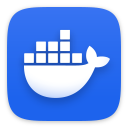</th>
    <th></th>
    <th>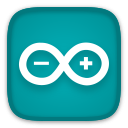</th>
    <th></th>
    <th></th>
    <th></th>
    <th></th>
    <th></th>
    <th></th>
    <th></th>
  </tr>
  <tr>
    <th></th>
    <th></th>
    <th></th>
    <th></th>
    <th></th>
    <th></th>
    <th></th>
    <th></th>
    <th>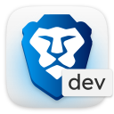</th>

  </tr>
    <tr>
    <th></th>
    <th></th>
    <th></th>
    <th></th>
    <th>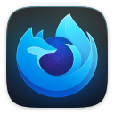</th>
    <th></th>
    <th></th>
    <th></th>
    <th></th>
  </tr>
  <tr>
    <th></th>
    <th></th>
    <th>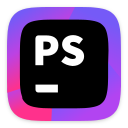</th>
    <th>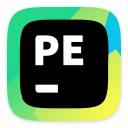</th>
    <th></th>
    <th>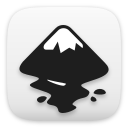</th>
    <th></th>
    <th></th>
    <th>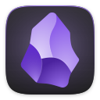</th>
    <th></th>
  </tr>
  <tr>
    <th></th>
    <th></th>
    <th></th>
    <th></th>
    <th></th>
    <th></th>
    <th></th>
    <th>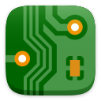</th>
    <th>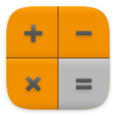</th>
    <th></th>
  </tr>
  <tr>
    <th></th>
    <th></th>
    <th>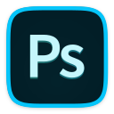</th>
    <th></th>
    <th>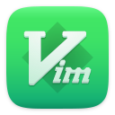</th>
    <th></th>
    <th></th>
    <th></th>
    <th></th>
    <th></th>
  </tr>
  <tr>
    <th></th>
    <th></th>
    <th>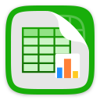</th>
    <th></th>
    <th></th>
    <th>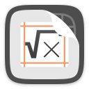</th>
    <th></th>
    <th>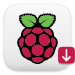</th>
    <th></th>
    <th>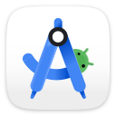</th>
  </tr>
    <th></th>
    <th>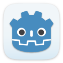</th>
    <th>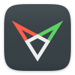</th>
    <th>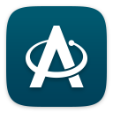</th>
        <th>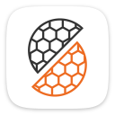</th>
    <th></th>
    <th></th>
  </tr>
</table> 

<h3 align="center">Games</h3>
<table>
  <tr>
    <th></th>
    <th>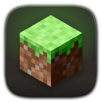</th>
    <th></th>
    <th></th>
    <th>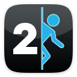</th>
    <th></th>
    <th>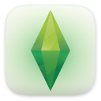</th>
    <th></th>
    <th>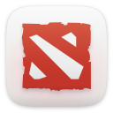</th>
    <th></th>
  </tr>
</table> 

<h3 align="center">System tools</h3>
<table>
  <tr>
    <th>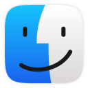</th>
    <th></th>
    <th></th>
    <th>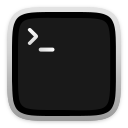</th>
    <th></th>
    <th></th>
    <th></th>
    <th></th>
    <th></th>
    <th></th>
  </tr>
</table> 
